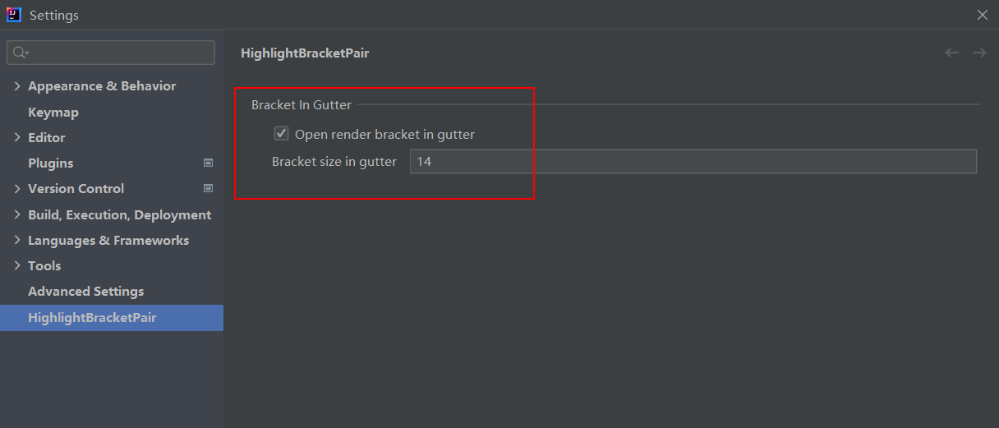

# highlight-bracket-pair #

   

## Plugin Description

<!-- Plugin description -->

The plugin can color highlight the Bracket Pair in editor for IntelliJ. 

New feature: can render the bracket color in gutter. 

highlight-bracket-pair maybe support Languages: Java, Groovy, Kotlin, Scala, Haskell, Python, JavaScript, TypeScript, Golang, Ruby, Erlang, Rust, Html, XML, Json, CSS....Of course, the support for certain languages is not perfect. 

FROM <a href="https://github.com/qeesung/HighlightBracketPair">qeesung#HighlightBracketPair</a>.Fix bugs and continue to develop new features. 

If you have any questions or get more information, you can go to <a href="https://github.com/AprilViolet/highlight-bracket-pair">Github</a>.Thanks.

<!-- Plugin description end -->

## Screenshots ##

+ Display of results

+ Render bracket in gutter.

+ Settings

## Installation

- Using IDE built-in plugin system:
  
  <kbd>Settings/Preferences</kbd> > <kbd>Plugins</kbd> > <kbd>Marketplace</kbd> > <kbd>Search for "highlight-bracket-pair"</kbd> >
  <kbd>Install Plugin</kbd>
  
- Manually:

  Download the [latest release](https://github.com/AprilViolet/highlight-bracket-pair/releases/latest) and install it manually using
  <kbd>Settings/Preferences</kbd> > <kbd>Plugins</kbd> > <kbd>⚙️</kbd> > <kbd>Install plugin from disk...</kbd>

## How to customize colors ##

+ Settings/Preferences > Editor > Color Scheme > HighlighterBracketPair

## How to contribute ##

+ Clone the code.
+ Open with idea

**Preconditions**

+ **Note that the project is built on the LTS version of the JDK11.**
+ **Build with gradle, the gradle version is the latest Gradle7.4.1**

---
Plugin based on the [IntelliJ Platform Plugin Template][template].

[template]: https://github.com/JetBrains/intellij-platform-plugin-template
